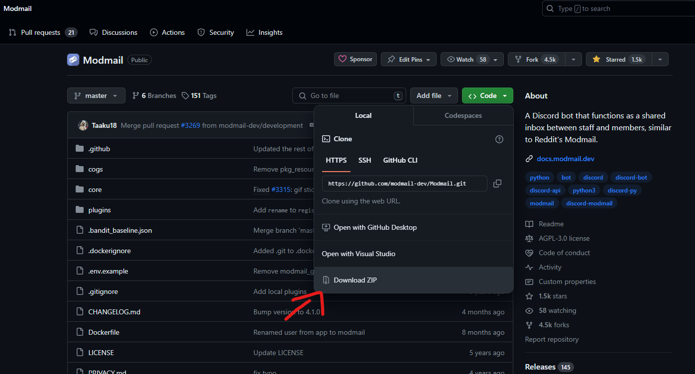
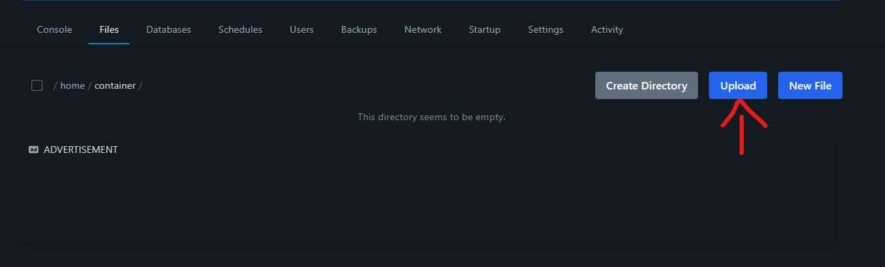
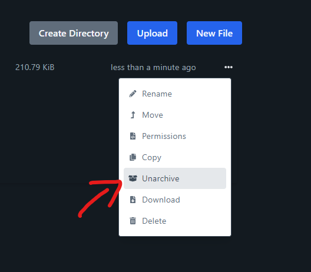

# Pterodactyl

## What is Pterodactyl? 

Pterodactyl is an open source software providing instances to run game servers (based on docker) originally. But this software can also be used running other applications based on python, nodejs etc. so also our python based modmail bot.

The panel is available to host for yourself or you can use hosting providers offering you access to a panel.

More info at: https://pterodactyl.io/

## Is the panel secure

## Requirements 

* A pterodactyl panel either hosted by yourself or offered by a hosting provider.
* A server installed on your panel that can run python applications.
* You have completed the initial steps: [invited your bot](./#create-a-discord-bot) and [created a MongoDB database](./#create-a-mongodb-database).

## 1. Download the bot on GitHub
Visit https://github.com/modmail-dev/Modmail and download the bot as a zip file.
<figure></figure>

## 2. Upload the zip file into the server via the filemanager.
Your downloaded zip file needs to be uploaded into your server in the panel.
<figure></figure>

## 3. Unarchive the zip file
Unarchive the uploaded zip file and delete the original uploaded .zip file as we are using the Modmail-master folder.
<figure></figure>